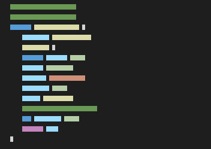

# infinite-code-scroll
infinite scrolling code-like things on webpage.

# Usage
0. Include `codeScroll.js` in your HTML file ``
1. Create a canvas inside a `div` container.
2. Give the canvas an ID of `infinite-code-scroll` and the container `code-scroll-container`.
3. Configure colors and setup variables in `codeScroll.js`
